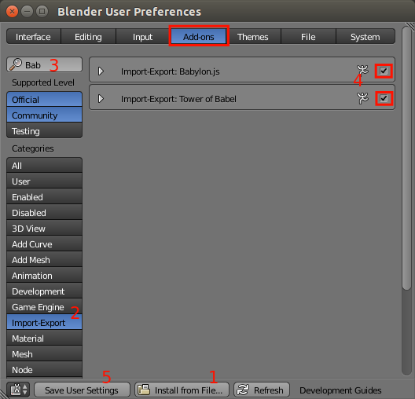
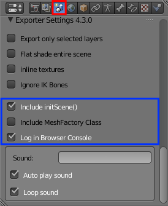
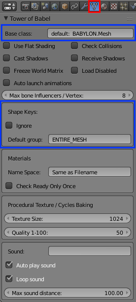
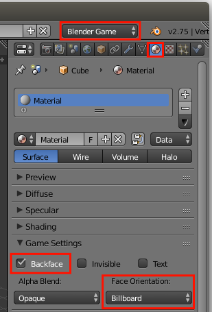
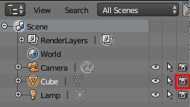
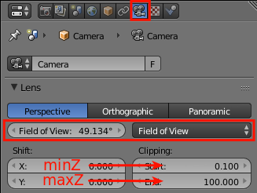
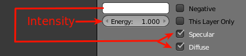
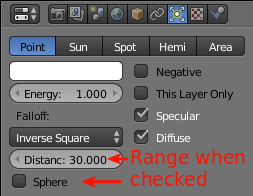
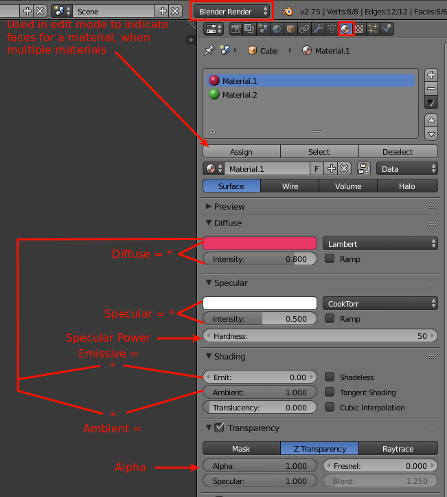
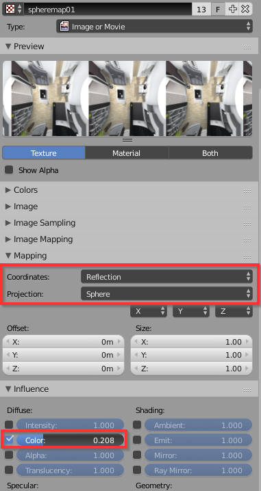

# Tower of Babel Exporter for Blender, 4.4


## Background ##

All Add-ons for Blender need to be written in Python.  The original Blender exporter was written as a single static class with some helper functions.  Everything was converted from Blender's representation of things to BJS's at the same time as it was written out, in a single pass.  Some of the conversions made were from quads to triangles, and switching the Y and Z axes.

Tower of Babel started with that code base, re-factoring it into a set of classes that represented each of the various scene object types, .e.g. Lights, Materials, Cameras, &amp; Meshes.  The idea was that the main class would make a first pass through the Blender scene, creating instances of all these classes.  The constructors of each of these classes was responsible for all the conversion needed to represent things in BJS, and storing this data as members of that instance.

The main class could then make a 2nd pass, against the collections of these Python classes, and execute a `to_scene_file()` method, that each class had.  Since all the information had already been preprocessed to be compatible, all these methods had to was the bare minimum to write-out their information in JSON format, A.K.A. a .babylon file. 

Hmm, if there was also a method in each class named `to_script_file(is_typescript)`, then an in-line .JS and / or .TS module source file could also be generated from the same information.  Early Tower of Babel versions could generate all 3, and was the inspiration for the name Tower of Babel.  

Eventually, the .babylon exporter was replaced with the Tower of Babel code base, with source code generation removed.  Tower of Babel, itself, no-longer generates a .babylon file.  There is an attempt to keep the first pass of both as similar as possible using diff tools.  Either exporter can be used in Blender without the other.  

They can also both be present.  When this is the case, the custom properties of only one will display, the last used or installed.  You can also explicitly turn one off in Blender Preferences.  Fortunately, the common properties are named the same, so the settings transfer back and forth.

## New in 4.4 ##

- Support for saving textures in a sub-directory from the main file.

## New in 4.3 ##

- Fixes from 4.2.1: Node typo, better .ik bone detection, & rest pose for bones.
- Typescript is no longer an option.  A .JS & .D.TS are always generated.  The code examples at bottom are still in Typescript though.
- The `to_scene_file()` methods to make a .babylon in this file.  Makes it easier to do a side by side diff.  Code never called here.

## New in 4.2 ##

- Blender Actions support, see **Actions** section
- Skeleton animation library .blends now supported, see **Armatures** section
- Inverse Kinematics friendly skeleton exporting, see **Armatures** section
- Export time much shorter for .blends with armatures with actions

## New in 4.1 ##

- Added export of bone length
- Fixed flawed checking for bone animation optimization

## New in 4.0 ##

### Skeletons ###

**Variable bone / vertex influencers (1-8)**- Export and check what the log file said was the highest # of Influencers observed.  You might then go to the custom properties for the mesh (see below), and lower the 'Max bone influencers / vertex' below what was observed, then export again.  Often times you may not notice much or any damage / stiffness when animated.  Lowering from 5 to 4 will also reduce cpu &amp; gpu memory requirements, but they all reduce processing.

**Vertex optimization using a skeleton**- Previously, having a skeleton for a mesh would cause no sharing of vertices between triangles.  This is no longer the case.  This reduces the size of vertex positions, normals, uvs, colors, skeleton info, and shape keys dramatically.  It will also reduce shape key, and cpu skinning processing.

### Shape keys ###
The internal processing of shape keys was re-designed (for the 2nd time).  It works much better when the mesh also has a skeleton, and processes much faster.

### Others ###

- Flat shading of meshes is now implemented in exporter, instead of BJS.  Shape keys meshes can now flat shaded.
- checkReadyOnlyOnce for a material changed to off by default.  Turn on manually for a Mesh in custom properties.
- You may specify a name space for a material for sharing across .blend files.
- Meshes may be loaded disabled along with their children.
- Meshes inheriting from QI.Mesh, may be in a Mesh Class Factory, as long as it has no shape keys.
- The material baking process will use UV1 when one is found, instead of always creating one.

## Installation ##

  

1. Go to File->User Preferences->Addons Tab
2. Click the `Install from File...` Button (1 in image).
3. Navigate to where you have downloaded / expanded the .PY file, and complete the operation.
4. Click on the `Import-Export` button (2 in image) to reduce the list of add-ons to only that type.
5. Reduce the list further by typing 'bab' in the search field (3 in image).
6. Click the check box of the add-on to activate it (4 in image).
5. Click on the `Save User Settings` button, in order not to have to repeat the activation process next time you open Blender.

## Compare / Contrast to .babylon Exporter ##

### Differences due to the type of the file generated. ###

**Loading / Calling**-  A .babylon file is treated as data, and must be loaded asynchronously.  If you need to execute code that is reliant on a .babylon loading, it must be provided as a callback function to scene loader.  Things can get tricky when there is a whole series of .babylon files. All .JS files are loaded and parsed prior to any JavaScript executing.  (You can create a script element and append it to document.head from within Javascript though.)  This means any objects can be instanced simply using `new`, then placing any reliant code on the next line, e.g. 

```typescript
// materialsRootDir and source optional
var mesh = new ModuleName.MeshClass("name", scene, materialsRootDir, source);
mesh.position.x = 6;
```
**Combining &amp; Uglify**-  .JS module files can be combined together with others (there could be order issues though), while .babylon files cannot.  The generated .JS modules are meant to be readable with lots of whitespace.  When deploying, they can also be uglified.  If your files become very large or your web server has limited bandwidth, the difference in load behavior may be pronounced, though.  A combined &amp; uglified approach probably will result in a faster up and running scene than a .babylon, but appear less responsive.  This does not apply to mobile apps, where download occurs during app install.

**OO development &amp; source code management**-  A .babylon file must have Javascript which reads it, `BABYLON.SceneLoader`, and then takes the data and constructs `BABYLON.Mesh` objects.  There is no dynamic code execution in Javascript, so no sub-classing of `BABYLON.Mesh` is possible with a .babylon.  See Meshes under Features to see Tower of Babel's sub-classing capabilities.  Also, generated source code files, especially .TS files, are much better for placing in repositories like, Git.

### Skeleton animation ###

The traditional BJS animation system, requires that skeletal animation have every frame. The .babylon file has a "baked" animation for bone animations.  While Tower of Babel only sends the key frames.  It is expected that if you are exporting with Tower of Babel that you will be using the QueuedInterpolation animation extension.  It generates any non-key frames, which is much more space efficient.

### Feature Differences ###

Currently, the 2 exporters are pretty close feature wise.  Here are the features unique to Tower of Babel:

- Morphing using Shape keys
- Cloning using Mesh Class Factories

### BJS version Required ###

The .TS / .JS files check that BJS 2.3 or greater is running.  Bone influencers > 4 will not run until 2.3.  The Queued Interpolation runtime, which implements shape keys is also dependent on 2.3.

## Features &amp; Usage ##

This document is not going to attempt to describe the actual mesh modeling or material creation in Blender.  There are many resources that show that.  We are concerned here with which features of Blender are exportable, and how to access them.

There are custom properties that are explicitly added by the exporter to control the export.  There are also built-in properties that are mapped into BJS properties.

### Custom Properties ###

Custom properties are added for the exporter as well as for Mesh, Camera, &amp; Light object types. The properties for objects are displayed as a section on their respective Data properties Tab.  Those bordered in blue, will not be in the .babylon exporter.

| Exporter (on Scene tab) | Mesh |
| --- | --- 
||

| Camera | Light
| --- | --- 
||

The settings for each are saved with the .blend file.

### Mapped Properties ###

Blender has many scattered properties that are taken into account by the exporter.  Here is an assortment of where these properties are located:

| World (Blender Render)| Blender Game Render Settings | Rotation Units
| --- | --- | ---
|Horizon color must be shared.|Set on the material not the mesh.|Default is `XYZ Euler`.  Meshes &amp; Cameras may also be `Quaternion`.
|||

|Outliner
| ---
|Click camera off to load a mesh invisibly
|

### Meshes ###

Meshes are output as a public sub-class of the base class custom property when they do not have a mesh as a parent, a root mesh.  They are instanced using `new`, and can be further sub-classed by any hand written code you wish to make. Here is the syntax again (source is for cloning):

```typescript
// materialsRootDir and source optional
var mesh = new ModuleName.MeshClass("name", scene, materialsRootDir, source); 
```

Meshes that are the children of another mesh are output as an internal function which returns an instance of the base class custom property.  These child functions are called by the constructor of the parent mesh, never by you.  

#### Instances ####

Instances, as BJS defines them, are objects of type `BABYLON.InstancedMesh`.  Their purpose is to take advantage GPU hardware acceleration available for identical meshes, including material.  They are made in Blender using the `Object->Duplicate Linked` menu item in the 3D View.  They are implemented as a public method, `makeInstances()`, for root meshes.  Instances of child meshes are in-lined into the private function that also builds them.

#### QI.Mesh Classes ####

If a mesh contains shape keys or you wish to use the bone interpolator, then it needs to inherit from a `QI.Mesh` base class.  If you do not specify a base class, it will default to `QI.Mesh` if it has shape keys.  Otherwise, you will to explicitly set this in custom mesh properties.

You create a `Basis` shape key and all of the other keys relative to it.  The name of the shape key is important.  The format is `SHAPE_KEY_GROUP-KEY`, and all upper case.  This provides for having groups like FACE, LEFT_HAND, etc.  The default shape key group assigned to a key not in this format is `ENTIRE_MESH`.  If you imported a Make Human with shape keys, you need to change this to `FACE` in addition to changing the base class to `QI.MakeHuman`.

On the BJS side, having separate groups allows for concurrent, independent deformations.  No morphing animation in Blender is transferred.  Skeletal animation will be transferred, however it may not be processed the same way for meshes with a `QI.Mesh` base class.

#### Mesh Class Factories ####

This feature allows Meshes to be instanced on demand, using the existing geometry of another instance, if available.  The BJS terminology for this is cloning.  Sharing of geometry reduces GPU &amp; CPU memory, and is very fast to create due to the lack of GPU calls to load data.  This is enabled using a custom property checkbox in the exporter, see above. The class factory needs to be initialized and then called like:

```typescript
var factory = new ModuleName.MeshFactory(scene, materialsRootDir); // materialsRootDir optional
var mesh = factory.instance("meshClassNm1", cloneSkeleton); // cloneSkeleton optional
```
cloneSkeleton is an optional argument.  When `true`, it also clones the skeleton from the source.  It has no meaning unless the mesh class has an armature.

If there are multiple exports with class factories in them, the optional Tower of Babel runtime (part of the QueuedInterpolation extension, QI) can assist with grouping factories together, so you can specify both the modulename and mesh class as strings.  The Dialog extension uses this so Letter meshes can specified as:

```typescript
//get a W mesh from the Font2D module 
TOWER_OF_BABEL.MeshFactory.instance("Font2D", "W"); 
```
 To use the runtime, A factory, once instanced, must be pushed onto the array of factories like:
 
```typescript
TOWER_OF_BABEL.MeshFactory.MODULES.push(new Font2D.MeshFactory(scene));
```

#### Nodes ####

Blender nodes are implemented as meshes in BJS, without any geometry.  Useful for assigning a common parent among meshes.  Fcurve animations are also possible with nodes.

### Cameras ###

The initial position and direction of the camera is transferred, but not always by the same means.  Cameras can also be preset to track to an object, called a locked target in BJS.  Arc Rotate &amp; Follow cameras required a mesh to track, or they cannot be exported.  The easiest way to set up tracking is using the 3D view.

- Right click the camera.
- Shift right click the mesh to track to.  
- Press Cntrl T, which brings up a menu. 
- Select `Track to Constraint`.  

To see what this looks like. view the Constraints Tab of Camera below, where this could also used to do the setup.

| Camera Constraints|Camera Mapped Settings 
| --- | --- 
||

### Lights / Shadow Generating ###

Blender has different names for light types than BabylonJS.  Actually, Blender calls them lamps, not Lights.  Here is how they correlate:

|Blender | BabylonJS | Shadow Capable | Transfers Position | Transfers Direction
| --- | --- |:---:|:---:|:---:
|Point | Point          |   | √ |
|Sun   | Directional    | √ | √ | √
|Spot  | Spot           | √ | √ | √
|Hemi  | Hemi           |   |   | √
|Area  | Point(no range)|   | √ |

There are also some mapped properties. Some that are always used, and some specific to certain types.

|Common to All
| --- | --- 
|

| Point|Spot 
| --- | --- 
||


### Materials ###

Materials that are just made up of colors are setup using the Blender Render, as seen below.  Making `MultiMaterials` are a matter of assigning more than one material for a mesh.  Once you have the materials, enter edit mode, select faces to have a materials,then click Assign.



#### Textures ####

Textures can be added to a material of a mesh, so the faces that are assigned the texture are the materials. Image textures are normally just a file copy, with some properties mapped to BJS.  

If there are procedural textures in any materials for a mesh, then any image textures are just worked into the baked images instead.  Procedural textures are rendered in Blender, then output as an image.  Properties are used in the rendering / baking process, rather than being mapped into BJS properties.  This opens up many more properties that can be used than mapped using image textures. 

|Procedural Textures| Image Textures
| --- | ---
||

|Spheremap
| ---
|How to set a texture to get a spheremap
|

#### in-line textures ####

Textures do not need to be in a separate file.  They can also be inside either the .JS or .babylon file.  The size of the combined file will be larger, but assuming you are using gzip on your server, the transmission is about the same.  Other than just being self-contained,  having fewer files can improve the time a web page downloads due to the latency of doing each file.

#### Cycles Render / Texture Baking ####

The Cycles Render is supported by baking out a set of textures that BJS can accept.  Lighting / shadows are not taken into account as part of the baking.  If your Cycles material is a simple diffuse node, setting a color, you are far better off replacing it with an equivalent material using the Blender Render.  You avoid doing texture lookups in the fragment shader, and do not waste GPU memory.  A texture takes up much more GPU memory than disk space, since it is compressed on disk.

When baking textures, either from Cycles or Blender Render Procedural textures, the dimensions are set on a mesh by mesh basis.  This is part of the custom properties of a mesh.  It is highly recommended to make this a power of 2.  The format output is .JPG.  The quality setting controls the compression on disk.

### Actions ###

Action animations for Meshes, lights, and Cameras are transferred on export.  AnimationRanges are new in BJS as of 2.3. For each action, a corresponding AnimationRange object with the same name is made on import to BJS.  

See the table below for which properties are animatable, based on the object type.  If the custom property `Auto Launch Animations` is checked, then these will start when the object created.  This will play the entire animation, so may not useful when there are multiple actions, as all will be played.

|Object Type| Rotation (Vector &amp; Quaternion)| Position | Scaling
| --- |:---:|:---:|:---:|
|**Meshes &amp; Nodes**| √| √| √
|**Cameras** | √| √ |
|**Lights** | | √| 

### Armatures ###

Armatures are exported along with their actions as AnimationRanges.  It is no longer a requirement that an armature be the parent of a mesh it controls. Skeletal animations cannot be set to auto animate.

**Variable bone / vertex influencers (1-8)**- Export and check what the log file said was the highest # of Influencers observed.  You might then go to the custom properties for the mesh, and lower the 'Max bone influencers / vertex' below what was observed, then export again.  Often times you may not notice much or any damage / stiffness when animated.  Lowering from 5 to 4 will also reduce cpu &amp; gpu memory requirements, but they all reduce processing.

**Inverse Kinematics Friendly**- There is a custom exporter property (on Scene tab), `Ignore IK Bones`.  The effect is any bone with `.ik` in the name will not be exported.  Any extra bones that are needed to make inverse kinematics work will never make it to BJS.  So now you can do all your posing for your key frames more easily in Blender, without the baggage following you to BJS.

**Skeleton Animation Libraries**- As of BJS 2.3, the AnimationRanges of a skeleton can be transferred to another with the same bone structure.  The bone lengths can be taken into account during the copy to compensate for skeletons which are shorter, wider, or expressed in different units e.g. inches vs meters.  Here is an example of implementing a library as 2 .babylon files:

```Typescript
var scene = new BABYLON.Scene(engine);
        
BABYLON.SceneLoader.Append(url, "meshes.babylon", scene);
BABYLON.SceneLoader.Append(url, "skeleton_library.babylon", scene);
scene.executeWhenReady(function () {
     var meshSkeleton = scene.getSkeletonByName("name");
     var library = scene.getSkeletonByName("library");

     meshSkeleton.copyAnimationRange(library, "myAction", true); // true says to rescaleAsRequired
     meshSkeleton.beginAnimation("myAction");
     ...
});
```

**Animation Differences**- The traditional BJS animation system, requires that skeletal animation contain every frame. The .babylon file has these "baked" animations for bones.  While Tower of Babel only saves the key frames.  It is expected that if you are exporting with Tower of Babel that you will be using the QueuedInterpolation animation extension.  It generates any non-key frames at runtime, which is much more space efficient.

This does not mean that you must bake any of your actions, skeletal or not, to produce a .babylon.  Keeping only the key frames is much more flexible than actually baking it into the .blend file.

### Log File ###

Another file always generated is the log file.  It has the same name as the script file or .babylon file with the extension .log.  It provides information about what was or was not done.  Many possible warnings are provided, instead of just leaving you wondering why something did not come through.  Most importantly, should the exporter terminate with an error, it will be contained in this file.  Here is part of one:

```
	Exporter version: 3.0.0, Blender version: 2.75 (sub 0)
========= Conversion from Blender to Babylon.js =========
	Python World class constructor completed
	processing begun of mesh:  Cycles Torus
		processing begun of baked material:  Cycles Torus
			Cycles baking texture, type: DIFFUSE_COLOR, mapped using: BakingUV
		num positions      :  1383
		num normals        :  1383
		num uvs            :  2766
		num uvs2           :  0
		num colors         :  0
		num indices        :  3456
	processing begun of mesh:  Cycles Torus 1
		mesh is an instance of :  Cycles Torus.  Processing halted.
	processing begun of mesh:  Ground
		processing begun of baked material:  Ground
		
		...
		
	processing begun of light (SUN):  Directional_Lamp
	processing begun of shadows for light:  Directional_Lamp
	processing begun of light (HEMI):  Hemi_Lamp
========= Writing of javascript file started =========
========= Writing of javascript file completed =========
========= end of processing =========
elapsed time:  0 min, 19.1473 secs
		
```

## Structure of Generated Module ##

The typescript module version is the one described below.  There are 2 features that are omitted from the sample code though:

- Every entry point validates that the version of Babylon is compatible, as shown below.  This is omitted from all other sample code.  
- Optional console browser logging done when entry points are called.

```typescript
if (Number(BABYLON.Engine.Version.substr(0, BABYLON.Engine.Version.lastIndexOf("."))) < 2.3) throw "Babylon version too old";
```

As with all .TS files, it starts off defining the module that the classes are a part of.  The module name matches the file name you made for the export.

```typescript
// File generated with Tower of Babel version: 4.0.0 on 12/14/15
module ModuleName{
    ...
```

### initScene() ###

If you indicated that you wanted an `initScene()` included, it will be generated next.  When you call this function in your application code, it will do the .babylon file equivalent of `BABYLON.SceneLoader.Append()`.  You pass a previously instanced scene as an argument, and may also pass `resourcesRootDir`.  `resourcesRootDir` is very tolerant about whether you terminate it with a `/` or not.  The default is the same as the html file. When `initScene()` is called, the root directory of texture files &amp; sound files must be the same.

The example below shows when everything is present.  The calling of the definition of skeletons, cameras, sounds, lights, and shadows are only added when there are some to define.

```typescript
export function initScene(scene : BABYLON.Scene, resourcesRootDir : string = "./") : void {
    scene.autoClear = true;
    scene.clearColor    = new BABYLON.Color3(0,0,0);
    scene.ambientColor  = new BABYLON.Color3(0,0,0);
    scene.gravity = new BABYLON.Vector3(0,-9.81,0);

    // define materials & skeletons before meshes
    defineMaterials(scene, resourcesRootDir);
    defineSkeletons(scene);

    // instance all root meshes
    if (typeof (TOWER_OF_BABEL) !== 'undefined'){
        TOWER_OF_BABEL.MeshFactory.MODULES.push(new MeshFactory(scene));
        TOWER_OF_BABEL.MeshFactory.instance("ModuleName", "meshClassNm1", true);
        TOWER_OF_BABEL.MeshFactory.instance("ModuleName", "meshClassNm2", true);
    } else {
        new meshClassNm1("meshClassNm1", scene);
        new meshClassNm2("meshClassNm2", scene).makeInstances();
    }

    // define cameras after meshes, incase LockedTarget is in use
    defineCameras(scene);

    // define sounds after meshes, incase attached
    defineSounds(scene, resourcesRootDir);

    // cannot call Shadow Gen prior to all lights & meshes being instanced
    defineLights(scene);
    defineShadowGen(scene);
}
```

The example above shows when a MeshFactory class is also included.  A check is made for the Tower of Babel runtime.  If it's found then the MeshFactory is installed into it, and mesh instances are made that way.  When is MeshFactory not included, only the direct method using `new` is present.

### MeshFactory Class ###

This is an example of a mesh factory, showing only one class that is instance able, `meshClassNm1`.  The below switch statement will be expanded with a case statement for each root level mesh in the module that does not contain shape keys.  See section in Features &amp; Usage, above, for calling instructions.

```typescript
var meshLib = new Array<Array<BABYLON.Mesh>>( **NUMBER_OF_ROOT_MESHES** );
var cloneCount = 1;

var originalVerts = 0;
var clonedVerts = 0;
export class MeshFactory implements TOWER_OF_BABEL.FactoryModule {
    constructor(private _scene : BABYLON.Scene, materialsRootDir: string = "./") {
        ModuleName.defineMaterials(_scene, materialsRootDir); //embedded version check
    }

    public getModuleName() : string { return "ModuleName";}
    public instance(meshName : string, cloneSkeleton? : boolean) : BABYLON.Mesh {
        var ret:BABYLON.Mesh = null;
        var src:BABYLON.Mesh;
        switch (meshName){
            case "meshClassNm1":
                src = getViable(0);
                if (src === null){
                    ret = new meshClassNm1("meshClassNm1", this._scene);
                    originalVerts += ret.getTotalVertices();
                    meshLib[0].push(ret);
                }else{
                    ret = new meshClassNm1("meshClassNm1" + "_" + cloneCount++, this._scene, null, <meshClassNm1> src);
                    clonedVerts += ret.getTotalVertices();
                }
                break;
                
            ... more root mesh case sections
        }
        if (ret !== null){
            if (cloneSkeleton && src && src.skeleton){
                var skelName = src.skeleton.name + cloneCount;
                ret.skeleton = src.skeleton.clone(skelName, skelName);
            }
        }
        else BABYLON.Tools.Error("Mesh not found: " + meshName);
        return ret;
    }
}
function getViable(libIdx : number, isNode? : boolean) : BABYLON.Mesh {...}
function clean(libIdx : number) : void {...}
export function getStats() : [number] { return [cloneCount, originalVerts, clonedVerts]; }
```

### defineMaterials() ###

The defineMaterials() is a public module level function.  It is called from many of the other entry points, so you are not usually required to call it.  It also has checking at the beginning to ensure it only does something on the first call.

Shown below are a standard material, and another with a baked in-line texture.  The pattern will repeat for as many materials exported.

```typescript
var matLoaded = false;
export function defineMaterials(scene : BABYLON.Scene, materialsRootDir : string = "./") : void {
    if (matLoaded) return;
    if (materialsRootDir.lastIndexOf("/") + 1  !== materialsRootDir.length) { materialsRootDir  += "/"; }
    var material : BABYLON.StandardMaterial;
    var texture : BABYLON.Texture;
    
    if (!scene.getMaterialByID("get_baked.Dirt")){
        material = new BABYLON.StandardMaterial("get_baked.Dirt", scene);
        material.ambientColor  = new BABYLON.Color3(0.302,0.4121,0.8);
        material.diffuseColor  = new BABYLON.Color3(0.2416,0.3297,0.64);
        material.emissiveColor = new BABYLON.Color3(0,0,0);
        material.specularColor = new BABYLON.Color3(0.5,0.5,0.5);
        material.specularPower = 50;
        material.alpha =  1;
        material.backFaceCulling = true;
        material.checkReadyOnlyOnce = false;
    }
    if (!scene.getMaterialByID("shared.WoodMat_Ground")){
        material.ambientColor  = new BABYLON.Color3(1,1,1);
        material.diffuseColor  = new BABYLON.Color3(1,1,1);
        material.emissiveColor = new BABYLON.Color3(0,0,0);
        material.specularColor = new BABYLON.Color3(0.0275,0.0275,0.0275);
        material.specularPower = 50;
        material.alpha =  1;
        material.backFaceCulling = true;
        material.checkReadyOnlyOnce = false;
        texture = BABYLON.Texture.CreateFromBase64String("data:image/PNG;base64,...", "name", scene);
        texture.hasAlpha = false;
        texture.level = 1;
        texture.coordinatesIndex = 0;
        texture.coordinatesMode = 0;
        texture.uOffset = 0;
        texture.vOffset = 0;
        texture.uScale = 1;
        texture.vScale = 1;
        texture.uAng = 0;
        texture.vAng = 0;
        texture.wAng = 0;
        texture.wrapU = 0;
        texture.wrapV = 0;
        material.diffuseTexture = texture;
    
        ... more textures
    }
            
    ... more materials
    
    var multiMaterial : BABYLON.MultiMaterial;
    multiMaterial = new BABYLON.MultiMaterial("get_baked.Multimaterial#0", scene);
    multiMaterial.subMaterials.push(scene.getMaterialByID("get_baked.Dirt"));
    multiMaterial.subMaterials.push(scene.getMaterialByID("shared.WoodMat_Ground"));
    matLoaded = true;
}
```

### Meshes ###

#### Root Mesh Sub-Classes ####

Here is an example of a mesh which has no parent mesh.  It is implemented as a sub-class of the base class.

```typescript
export class MeshClass extends BABYLON.Mesh {
    // all child meshes are declared as public members and instanced in constructor
    public Appendage : BABYLON.Mesh;
    ...

    constructor(name: string, scene: BABYLON.Scene, materialsRootDir: string = "./", source? : MeshClass) {
        super(name, scene, null, source, true);

        ModuleName.defineMaterials(scene, materialsRootDir); //embedded version check
        var cloning = source && source !== null;
        
        // position, rotation, scaling section
        this.position.x  = 0;
        this.position.y  = 4;
        this.position.z  = 0;
        this.rotation.x  = 0;
        this.rotation.y  = 0;
        this.rotation.z  = 0;
        this.scaling.x   = 1;
        this.scaling.y   = 1;
        this.scaling.z   = 1;
        this.freezeWorldMatrix(); // generated based on custom property
        
        // child mesh instancing
        this.appendage = cloning ? child_Appendage(scene, this, source.Appendage) : child_Appendage(scene, this);
        ... more child meshes

        // miscellaneous properties section
        this.id = this.name;
        this.billboardMode  = 0;
        this.isVisible       = true;
        this.setEnabled(true);
        this.checkCollisions = false;
        this.receiveShadows  = false;
        this["castShadows"]  = true; // typescript safe
                
        // when has a physics imposter
        if (!scene.isPhysicsEnabled()) {
            scene.enablePhysics();
        }
        this.setPhysicsState({ impostor: 1, mass: 25.2, friction: 1.2, restitution: 9.2});
        
        // geometry loading section
        if (!cloning){
            // added when armature present
            defineSkeletons(scene);
            this.skeleton = scene.getLastSkeletonByID("0");
            this.numBoneInfluencers = 7;
            
            // not all may be present
            this.setVerticesData(BABYLON.VertexBuffer.PositionKind, new Float32Array([...]), false); // true when Morphing
            this.setVerticesData(BABYLON.VertexBuffer.NormalKind, new Float32Array([...]), false); // true when Morphing
            this.setVerticesData(BABYLON.VertexBuffer.UVKind, new Float32Array([...]), false);
            this.setVerticesData(BABYLON.VertexBuffer.UV2Kind, new Float32Array([...]), false);
            this.setVerticesData(BABYLON.VertexBuffer.ColorKind, new Float32Array([...]), false);
            this.setVerticesData(BABYLON.VertexBuffer.MatricesWeightsKind, new Float32Array([...]), false);
            this.setVerticesData(BABYLON.VertexBuffer.MatricesIndicesKind, new Float32Array([...]), false);
            this.setVerticesData(BABYLON.VertexBuffer.MatricesWeightsKindExtra, new Float32Array([...]), false);
            this.setVerticesData(BABYLON.VertexBuffer.MatricesIndicesKindExtra, new Float32Array([...]), false);
            this.setIndices([...]); // required

            this.setMaterialByID("namesapce.materialName");
            this.subMeshes = [];
            new BABYLON.SubMesh(0, 0, 2834, 0, 9792, this);
            if (scene["_selectionOctree"]) {// typescript safe
                scene.createOrUpdateSelectionOctree();
            }
        }
        // any mesh animations here
        ...
    }

    // when using a mesh factory class, this override is also added
    public dispose(doNotRecurse?: boolean): void {
        super.dispose(doNotRecurse);
        clean(3);  // the index into meshLib
    }

    // when mesh has Duplicate Linked meshes, this is also added
    public makeInstances(): void {
        var instance;

        instance =  this.createInstance("Instance 1");
        instance.position.x  = 15;
        instance.position.y  = 1.719;
        instance.position.z  = -5;
        // rotation & scaling as well, not shown
        instance.freezeWorldMatrix();
        instance.checkCollisions = false;
        
        ... more instances
    }
}
```

#### Child Mesh Instances ####

Here is the child mesh called by the root mesh above.  All of the same sections of the root mesh are present, except with 'ret' being assigned, not 'this'.
```typescript
function child_Appendage(scene : BABYLON.Scene, parent : any, source? : any) : BABYLON.Mesh {
    var ret = new BABYLON.Mesh(parent.name + ".Appendage", scene, parent, source);
    var cloning = source && source !== null;
    
    // same position rotation, scaling section,     
    ret.position.x  = 0;
    ...

    return ret;
}
```

#### Meshes inheriting from QI.Mesh ####

Meshes with shape keys must inherit from QI.Mesh class.  The code is the same as any other mesh, except positions &amp; normals are defined as update-able.  

After the standard mesh code, the shape key group assignments appear.  As each shape key group is created with each of its keys.  The `affectedPositionElements` of a group is the cut down list of positions used by the keys of the group.  Similar to `VertexGroups` of Blender.  Used for performance reasons.  Since a Basis key is part of every group, it is specified in the constructor.  It is not the whole Basis, just the part used by this group.

```typescript
export class Plane extends QI.Mesh {
    constructor(name: string, scene: BABYLON.Scene, materialsRootDir: string = "./", source? : MeshClass) {
        super(name, scene, null, source, true);
        
        // same mesh code as above
        ...
        var shapeKeyGroup : QI.ShapeKeyGroup;

        shapeKeyGroup = new QI.ShapeKeyGroup(this, "GroupName", new Uint32Array([affectedPositionElements]), new Float32Array([basisState]));
        shapeKeyGroup._addShapeKey("keyname",new Float32Array([stateKey]));
        ...  more keys
        this.addShapeKeyGroup(shapeKeyGroup);
        
        ... more shape key groups
}
```

### defineSkeletons() [Optional] ###

There is very little reason to call this yourself.  If you instance a mesh with a skeleton, this is called early in the constructor for you.  Like `defineMaterials()`, this only does something the first time it is called.

```typescript
var bonesLoaded = false;
export function defineSkeletons(scene : BABYLON.Scene) : void {
    if (bonesLoaded) return;
    var skeleton : BABYLON.Skeleton;
    var bone : BABYLON.Bone;
    var animation : BABYLON.Animation;

    skeleton = new BABYLON.Skeleton("skeletonName", "0", scene);
    bone = new BABYLON.Bone("hips", skeleton, null, BABYLON.Matrix.FromValues(...));
    animation = new BABYLON.Animation("anim", "_matrix", 30, 3, 1);
    animation.setKeys([
    {frame: 1, value: BABYLON.Matrix.FromValues(...)},
    ... as many frames as there are
    {frame: 45, value: BABYLON.Matrix.FromValues(...)}
    ]);
    bone.animations.push(animation);

    ... more bones

    bonesLoaded = true;
}
```

### defineCameras() [Optional] ###

if calling `defineCameras` yourself, be sure to wait until any mesh that might be a locked target for it has been instanced.

```typescript
export function defineCameras(scene : BABYLON.Scene) : void {
    var camera;
        
    camera = new BABYLON.ArcRotateCamera("Camera", -1.2873, -1.4918, 8.0977, scene.getMeshByID("MeshNm"), scene);
    camera.setCameraRigMode(0,{interaxialDistance: 0.0637});
    camera.rotation = new BABYLON.Vector3(0.4615,-0.8149,0.0981);
    camera.fov = 0.8576;
    camera.minZ = 0.1;
    camera.maxZ = 100;
    camera.speed = 1;
    camera.inertia = 0.9;
    camera.checkCollisions = false;
    camera.applyGravity = false;
    camera.ellipsoid = new BABYLON.Vector3(0.2,0.9,0.2);
    scene.setActiveCameraByID("Camera");
    // any camera animations here
    
    ... more cameras
    }
```

### defineSounds() [Optional] ###

Sound files can be assigned at both the scene and the mesh levels.  The sound is never really in Blender.  It is all custom property settings.  The scene is paused from rendering until the sounds are ready to play.

```typescript
var soundsLoaded = false;
export function defineSounds(scene : BABYLON.Scene, soundsRootDir : string = "./") : void {
    if (soundsLoaded) return;
    if (soundsRootDir.lastIndexOf("/") + 1  !== soundsRootDir.length) { soundsRootDir  += "/"; }
    var sound : BABYLON.Sound;
    var connectedMesh : BABYLON.Mesh;

    // version when sound assigned at the scene level
    sound = new BABYLON.Sound("sceneSound.wav", soundsRootDir + "sceneSound.wav", scene, 
                              () => { scene._removePendingData(sound); }, 
                              {autoplay: true, loop: false});
    scene._addPendingData(sound);
    
    // version when sound assign at the mesh level    
    sound = new BABYLON.Sound("mesh.wav", soundsRootDir + "mesh.wav", scene, 
                              () => { scene._removePendingData(sound); }, 
                              {autoplay: true, loop: false, maxDistance: 34.4});
    scene._addPendingData(sound);
    connectedMesh = scene.getMeshByID("MeshNm");
    if (connectedMesh) {
        newSound.attachToMesh(connectedMesh);
    }
    soundsLoaded = true;
}
```

### defineLights() / defineShadowGen() [Optional] ###

If there were any lights exported, the function `defineLights()` will be in the file.  All lights will be instanced one right after another (only one shown).  When a light has animations, they will be defined right after each light.

If any lights were set to be shadow generators, `defineShadowGen()` will also be in the file.  It is called at the end of `defineLights()` and not exported, so you cannot call it yourself.  The sample below only shows one generator, but if there were more, they would done one right after another.  The reason this function is even broken out is because a .babylon file defines shadow generators separate from lights.  This causes there to be 2 Python classes.  Having each class write out its own data is cleaner.

```typescript
export function defineLights(scene : BABYLON.Scene) : void {
    var light;
    
    light = new BABYLON.DirectionalLight("Directional_Lamp", new BABYLON.Vector3(0.0009,-0.3458,0.9383), scene);
    light.position = new BABYLON.Vector3(-0.0294,11.2822,-30.6172);
    light.intensity = 0.6;
    light.diffuse = new BABYLON.Color3(1,1,0.9);
    light.specular = new BABYLON.Color3(0,0,0);
    // any light animations here
    
    ... more shadow generators
    
    // added when there are any shadow generators
    defineShadowGen(scene);
    }
    
function defineShadowGen(scene : BABYLON.Scene) : void {
    var light;
    var shadowGenerator : BABYLON.ShadowGenerator;

    light = scene.getLightByID("Directional_Lamp");
    shadowGenerator = new BABYLON.ShadowGenerator(4098, light);
    shadowGenerator.bias = 0;
    shadowGenerator.useVarianceShadowMap = true;
    ...
    freshenShadowRenderLists(scene);
}
```

### freshenShadowRenderLists() ###

`freshenShadowRenderLists()` is for updating the renderlist's of all shadow generators, after being initially called at the end of `defineShadowGen()`.  Useful to call when generating meshes on demand, e.g. using a mesh factory. 

`freshenShadowRenderLists()` is a generalized function, to support definition of lights and shadows in separate .blends from meshes.  It is always included for convenience.  If you have multiple generated files, calling anyone once, is all that is required.
 
```typescript
export function freshenShadowRenderLists(scene : BABYLON.Scene) : void {
    var renderList = [];
    for (var i = 0; i < scene.meshes.length; i++){
        if (scene.meshes[i]["castShadows"])
            renderList.push(scene.meshes[i]);
    }

    for (var i = 0; i < scene.lights.length; i++){
        if (scene.lights[i]._shadowGenerator)
            scene.lights[i]._shadowGenerator.getShadowMap().renderList = renderList;
    }
}
```

## Running ##

The exported .JS file must of course be referenced in the `<head>` section of the launch html.  Depending on what features you take advantage of, other .JS files need inclusion as indicated.  If you combine / uglify, then use the order shown below:

```html
<head>
    <meta charset="UTF-8">
    <script src="http://cdn.babylonjs.com/2-3/babylon.js"></script>
    // A mesh inheriting from QI.Mesh requires the Queued Interpolation extension (includes TOB runtime)
    <script src="./QueuedInterpolation.1.0.js"></script>

    // any files holding a base class of a mesh goes prior to the generated file
    <script scr="./baseclass.js"></script>
    
    // the TOB generated file itself
    <script src="./myExportedModule.js"></script>
    
    // any files which might be subclassing any generated mesh classes
    <script src="./subclass.js"></script> 
    ...
</head>

```

