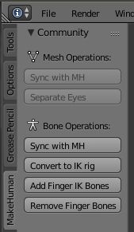
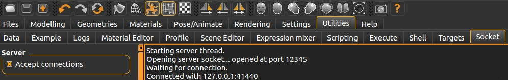
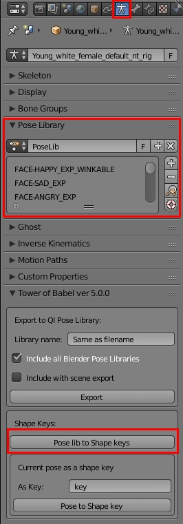
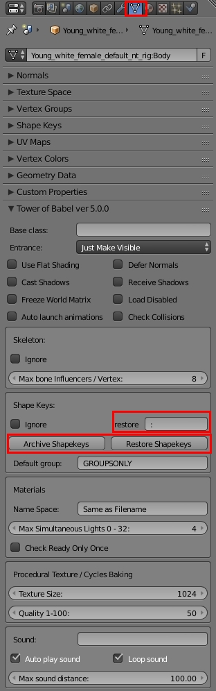
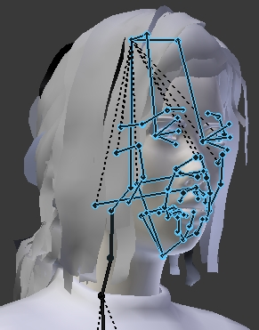

# BEING Expressions / Finger Shapekeys Workflow for MakeHuman#

These processes utilitize the [MHX2 plug-in](https://thomasmakehuman.wordpress.com/) & [MakeHuman Community plug-in](https://github.com/makehumancommunity/community-plugins/tree/master/blender_source/MH_Community).  The workflow below makes as little use of MHX2 as possible.  It clearly is the best format for Blender right now, however it is complicated, and has problems making / saving custom expressions (winking).  It also does not play well with Skeleton Libraries, which are key to this process.

The community plug-in contains operations to transfer information from the MakeHuman application to the Blender mesh / skeleton after import.  In theory, these operations could be performed when importing / exporting in format other than MHX2, but they are not as good.  The plug-in allows for publishing a workflow that has a minimum of UI to describe & options to use.  It's being used here to pre-process MH meshes upstream of export to BJS.  The 'Separate Eyes' operation actually supports BEING directly.

While the plug-in operations are performed once the mesh has been imported into Blender, it highly recommended that you perform them prior to modification of the meshes.

## Expressions ##
### In MakeHuman:###

1. Design a character, assigned with `GAME_RIG` skeleton, save and export via MHX2 (probably with 'Feet on Ground' checked).
2. Change the rig to Default No Toes, and export a 2nd time, adding ` default NT rig` on to the name.  There is no need to save this single change as a MakeHuman model.
3. On the `Utilities -> Socket` Tab: Click the `Accept connections` checkbox for later.
4. Leave MakeHuman running.

### Goto to Blender:###
1. Do an import of the Default No Toes using MHX2, no need to override defaults.
2. Goto the Armature Data Tab, and click the `New` button in the `Pose Library` section.  The name of library is of no importance.

Begin a process of transferring poses from Make Human to the library by switching to the `MakeHuman` (Community Plugin)  tab on the Tool Shelf.  For each expression you wish to transfer:

1. Change to MakeHuman application, and set expression desired in `Pose/Animate -> Expressions` Tab.
2. Change back to Blender, click `Sync with MH` in Bone Operators.
3. If exported with `Feet on Ground`, mesh will jump down.  Correct by selecting `root` bone & clearing transforms {Alt G, Alt R}
4. Click `+` to add the pose to the library.
5. Rename the pose, with a `FACE-` prefix, and for expressions a `_EXP` suffix.  If it might be appropriate to wink for this pose, also add a `_WINKABLE` or `_NO_BLINK` suffix.  See table below as an example.  You can use mixed case, if you wish, but on export everything is upper cased.

Note: Neither the `Sync with MH`, nor the adding of a pose to the library are affected by the bones which are selected.  All are synced.  All are saved with the pose.

|MakeHuman Pose | Blender Library Pose
| --- | ---
|smile02        | FACE-HAPPY_EXP_WINKABLE
|sad02          | FACE-SAD_EXP
|anger01        | FACE-ANGRY_EXP
|fear03         | FACE-SCARED_EXP_NO_BLINK
|laugh02        | FACE-LAUGHING_EXP_WINKABLE
|cry01          | FACE-CRYING_EXP_NO_BLINK
|determination01| FACE-DETERMINED_EXP
|effort03       | FACE-STRUGGLING_EXP_NO_BLINK
|disgust01      | FACE-DISGUSTED_EXP
|sceptical01    | FACE-SKEPTICAL_EXP

|Armature Data Tab | Mesh |
| --- | --- 
||

#### Custom Expressions / Winking####
The `Expression Mixer` in MH `Utilities` allows you to make your own expressions.  This is also how to make the 2 shape keys in the `WINK` shape key group.  Once you save the new expression, you need to restart MakeHuman before the expression shows up.  Here are the contents of the 2 Wink shapes I made for myself.  The wink expression files are in the list right above this Readme.

| WINK-LEFT | WINK-RIGHT
| --- | ---
|{                                               |{                                               |
|    "license": "Apache 2.0",                    |    "license": "Apache 2.0",                    |
|    "name": "WINK-LEFT",                        |    "name": "WINK-RIGHT",                       |
|    "copyright": "(c) Jeff Palmer 2016",        |    "copyright": "(c) Jeff Palmer 2016",        |
|    "tags": [                                   |    "tags": [                                   |
|        "no tag",                               |        "no tag",                               |
|        "expression"                            |        "expression"                            |
|    ],                                          |    ],                                          |
|    "author": "Jeff Palmer",                    |    "author": "Jeff Palmer",                    |
|    "unit_poses": {                             |    "unit_poses": {                             |
|        "LeftUpperLidClosed": 1.0               |        "RightUpperLidClosed": 1.0              |
|    },                                          |    },                                          |
|    "homepage": "https://github.com/Palmer-JC/",|    "homepage": "https://github.com/Palmer-JC/",|
|    "description": "For BJS BEING extension"    |    "description": "For BJS BEING extension"    |
|}                                               |}                                               |

### Key Generation###
Once you have all your poses:

1. Select the bones to be used to generate your face keys.  This is the first step in isolating which vertices will changed from the `Basis` value.  It is very important that keys be as small possible for quicker download & morphing performance.
2. Click the `Pose lib to Shape keys` button in the `Tower of Babel` section of the Armature Data Tab.

There will be extra keys generated, ones for the Eyes, and possibly others (maybe hair).  These will be discarded in the next step.

### Key Transfer###
The keys now are on the meshes, but this is not on a skeleton of reasonable size for WebGL.  Remember, that you exported twice.  To get keys on a mesh with the `GAME_RIG`, they need to be written to an archive file (.TOB).  Do that by:

1. Selecting meshes which should be archived, eliminating meshes where the keys should be discarded.
2. Click `Archive Shapekeys` button in the `Tower of Babel` section of the Mesh Data Tab.
3. Specify a file location.

Now import the mesh / armature you wish to have the keys.  This time clicking the `Restore Shapekeys` button, after selecting the meshes to receive them.  The names of the meshes will have a different name prefix, but anything before the delimiter (:) will be ignored.  If Collada or FBX formats become viable, the `restore delimiter` may need to be changed.

The restore should be done pretty early. The meshes need to have the exact same number of vertices at restore.  Also, afterwards you may not manually delete or add vertices.  Operations like `Limited Dissolve` also update the shapekeys, but export will not work when you manually change.

# Early Operations#
Utilizing Blender's filename incrementer, here are some things which would be a good idea as part of the first save.  Transferring any expressions is not recommended as part of the first save.  If you wanted to go back and add expressions though, having a first level save with all of this stuff already done, would be advisable.

## Other MakeHuman Community Operations##
There are also other operators made specifically for Babylon.JS which are safe to do prior to transferring expression shape keys.  These include:

- Separate Eyes into 2 separate meshes.  BEING can move eyes in a number of ways, but they need to be separate.
- Convert to IK Rig will add bones & bone contraints to a `GAME_RIG`.  The operation also tells exporter to ignore IK bones.
- Remove Finger Bones, incase either you will be doing via shape keys (similar to expressions) or not at all.  Important for mobile bone limits.

## Exporter Custom Properties / Materials changes##
Any settings that you know of, not just exporter, which does not change vertices means will make it easier to change expressions without have to re-do.  If you will eventually be merging all meshes which have expressions (recommended), you would only need to change exporter custom properties on the Body mesh.

## Parent other meshes to Body##
This not strictly need to be done except for the eye meshes, but is safe to do.  When the eyes were separated the exporter option to ignore the skeleton is checked.  Being a child mesh in BJS means .  You could also just uncheck 

# Finger shape keys#
Finger shapekeys start from posing a skeleton as well.  Fingers are very difficult to pose though due to the number of bones.  There is 

