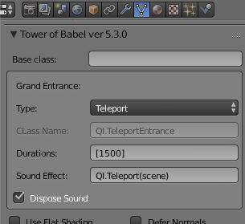
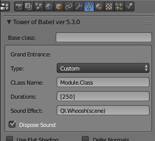

# Grand Entrances #

|Teleport|Custom
| --- | ---
||

Meshes without parents can be caused to appear with special effects.  There are 6 stock effects, listed below, as well as a way to assign your own made in Javascript.

|Entrance|Durations|Sound Code|Notes
| --- | --- | --- | ---
|Poof|1500|QI.Woosh(scene)|Done with ShaderBuilder
|Teleport|1500|QI.Teleport(scene)|Done with ShaderBuilder
|Fire|400|QI.Woosh(scene)|Requires BABYLON.FireMaterial.js
|Expand|250, 400|QI.Woosh(scene)|Done with scaling
|Gather|250|QI.Woosh(scene)|Done with generated shapekey
|Just Make Visible|N/A|N/A|Boring, but base class not required to inherit from QI.Mesh

## Custom Entrances ##
Custom Entrances will require that you specify a class name which is a sub-class of QI.AbstractGrandEntrance:
```typescript
module QI {
    export class AbstractGrandEntrance {
        /**
         * @constructor - This is the required constructor for a GrandEntrance.  This is what Tower of Babel
         * generated code expects.
         * @param {QI.Mesh} _mesh - Root level mesh to display.
         * @param {Array<number>} durations - The millis of various sections of entrance.
         * @param {BABYLON.Sound} soundEffect - An optional instance of the sound to play as a part of entrance.
         * @param {boolean} disposeSound - When true, dispose the sound effect on completion. (Default false)
         */
        constructor(public _mesh: QI.Mesh, public durations : Array<number>, public soundEffect? : BABYLON.Sound, disposeSound? : boolean) {
            if (this.soundEffect && disposeSound) {
                var ref = this;
                this.soundEffect.onended = function() {
                    ref.soundEffect.dispose();
               }
            }
        }

        public makeEntrance() : void {
            throw "Must be over-ridden by sub-classes"
        }
    }
}```

## Stock Sound Effects ##
