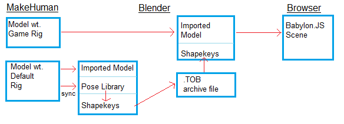
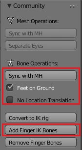
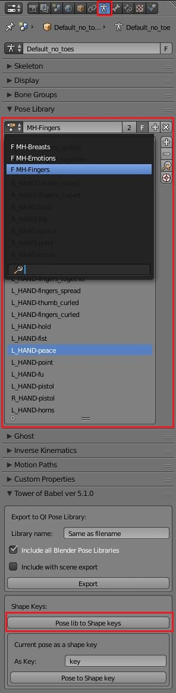
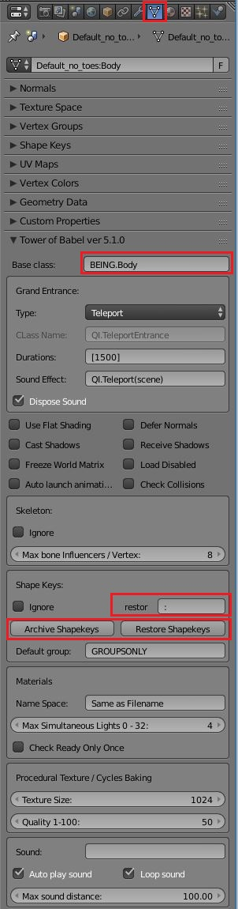
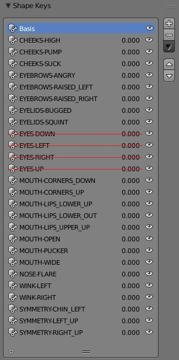
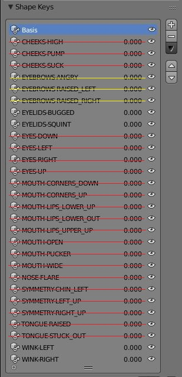
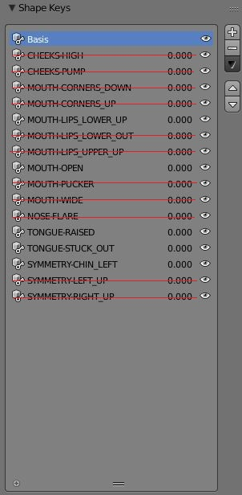
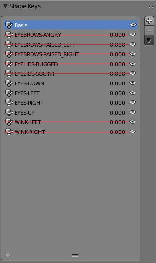
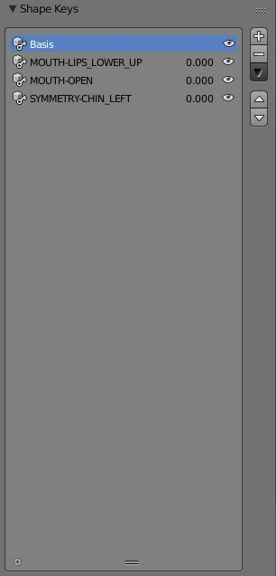
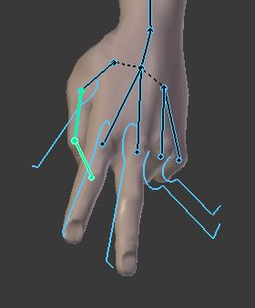

# QI.Automaton Class #
The Automaton base class is `QI.Mesh`.  Teeth, tongue, eye, eye brow, & eye lash meshes must be merged to the body, though this should probably only done just prior to export & not saved in .blend that way.  Any other meshes associated, e.g. hair, clothes, shoes, should be child meshes.  This class coordinates a number of separate independent functions:
- Facial expressions
- Blinking, both actively directed, and involuntary
- Winking
- Eye Movement
- Speech (development tools not publicly released)

The mesh that constitutes the `Automaton`, does not HAVE to come from MakeHuman.  It merely needs to have shapekeys whose naming conventions match what are expected.

### Demo Scenes ###

- [QA](https://palmer-jc.github.io/scenes/QueuedInterpolation/automaton/index.html)
- [Fingers](https://palmer-jc.github.io/scenes/QueuedInterpolation/finger_shapekeys/index.html)

# Expressions / Finger Shapekeys Work-flow for MakeHuman #

The process illustrated here allows one to define expression and finger shapekeys for use with the MakeHuman`GAME_RIG` by saving into pose libraries.  Unfortunately, Once the poses are in a Pose Library of a `.blend`, the pose library cannot be copied for all your models.  Differently shaped models in MH are achieved by altering the skeleton's orientation & length of bones.  Using pose libraries from different models will give inferior results. 

If you stick with using the defaults for hands though, there is a `fingerPoses.blend` in this directory with a whole set of poses for each hand.  Simply use Blender's `file->Append` to copy them.  Pose Libraries are found in the `Actions` directory.  Results seem the same from baby to adult.

## Required Plug-ins ##

### MHX2 ###
[MHX2](https://thomasmakehuman.wordpress.com/) has pieces installed in both MakeHuman & Blender (see its documentation). As little use of MHX2 as possible is made.  It clearly is the best MakeHuman transfer format for Blender right now, however it is complicated (multiple versions of the same skeleton), and has problems making / saving custom expressions (e.g. winking).  It also does not play well with pose libraries, which are key to this process.

### Tower-of-Babel ###
The [Tower-of-Babel](https://github.com/BabylonJS/Extensions/tree/master/QueuedInterpolation/Blender) add-in for Blender is also more than just an exporter.  It has many pieces which make this work-flow possible.  Indeed, the last step of actually generating in-line Javascript source code for the QueuedInterpolation extension of Babylon.JS is not actually required.  It could be used to transfer pose libraries to shapekeys for any purpose.

### MakeHuman Community ###

The [community](https://github.com/makehumancommunity/community-plugins/tree/master/blender_source/MH_Community) plug-in (also in 2 pieces) contains operations to transfer information from the MakeHuman application to the Blender mesh / skeleton after import.  In theory, these operations could also be performed when using a format other than MHX2, but those are not currently as good.  While the plug-in operations are performed once the mesh has been imported into Blender, it highly recommended that you perform them prior to modification of the meshes.

### Custom Expressions ###
The common set of expressions which need to be transferred are in the [customExpressionsMH](./customExpressionsMH) sub-directory.  They need to be copied to the MakeHuman user data directory, `Documents\makehuman\v1\data\expressions` for Windows.  If MakeHuman is running, then it will have to be restarted before they can be seen in the `Pose/Animate -> Expressions` tab.

## Expressions ##
### In MakeHuman : ###

1. Design a character, assigned with `GAME_RIG` skeleton, save and export via MHX2 (probably with 'Feet on Ground' checked).
2. Change the rig to Default No Toes, and export a 2nd time, adding ` default NT rig` on to the file name.  There is probably no need to save this single change as a separate MakeHuman model.
3. On the MakeHuman `Utilities -> Socket` Tab: Click the `Accept connections` checkbox for later.
4. Leave MakeHuman running.

### Goto to Blender: ###
1. Do an import of the Default No Toes export using MHX2, no need to override defaults.
2. Goto the Armature Data Tab, and click the `New` button in the `Pose Library` section.  The name of library is of no importance.
3. Transfer all the custom expressions from Make Human to the library by switching to the `MakeHuman` (Community Plug-in)  tab on the Tool Shelf.  If exported with `Feet on Ground`, insure the check below the `Sync with MH` is on.  The `No Location Translation` check must also off.  Set the tag for Expression transfer to `QI.Automaton`, then click the `To Pose Lib` button.

Notes: The Expression must not be set in MH.  Also, to counteract any possible side-effects enabling location translation, reset expression to None in MH, then click `Sync with MH` button.

|Armature Data Tab (library) | Mesh Tab |
| --- | --- 
||

### Key Generation ###
Once you have all your poses, click the `Pose lib to Shape keys` button in the `Tower of Babel` section of the Armature Data Tab.

For each pose, there will be shape key generated for each mesh where there is at least 1 vertex more than 0.00025 different than the basis value.  This is not an exact process, so extra keys will be generated which should not.  Eye browse / lids seems to have keys for everything.  These should be discarded before going on.  Not only will this reduce the final export file, but having the eyes participating in anything other than the 4 eye keys will cause many problems.

|Body Keys|Browse / Lids (+yellow)| Tongue |
| --- | --- | ---
|||

|Eye Keys|Teeth |
| --- | --- 
||

### Key Transfer ###
The keys now are on the meshes, but this is not on a skeleton of reasonable size for WebGL.  Remember, that you exported twice.  To get keys on a mesh with the `GAME_RIG`, they need to be written to an archive file (.TOB).  Do that by:

1. Selecting meshes which should be archived, eliminating meshes where the keys should be ignored.
2. Click `Archive Shapekeys` button in the `Tower of Babel` section of the Mesh Data Tab.
3. Specify a file location.

Now import the mesh / armature that you wish to have the keys on.  Then click the `Restore Shapekeys` button, after selecting the meshes to receive them.  The names of the meshes will have a different name prefix, but anything before the delimiter (:) will be ignored.  If Collada or FBX formats become viable, the `restore delimiter` needs to be changed.

The restore should be done pretty early. The meshes need to have the exact same number of vertices at restore.  Also, afterwards you may not manually delete or add vertices.  Operations like `Limited Dissolve` also update the shapekeys, but manual adds or deletes will not export correctly as the shapekeys are out of sync with geometry.

The base class of the body mesh needs to be set to `QI.Automaton`.  Teeth, tongue, eye, eye browse, & eye lash meshes need to be merged to the body, but delaying that just prior to export is recommended.

# Other MakeHuman Community Operations #
There are some other useful operations provided.  These operators were made specifically for Babylon.JS.  They are safe to do before or after transferring expression shape keys.  These include:

- `Convert to IK Rig` will add bones & bone constraints to a `GAME_RIG`.  The operation also tells exporter to ignore IK bones.
- `Remove Finger Bones`, in case either you will be doing via shape keys (similar to expressions) or not at all.  Important for mobile bone limits.

# Finger Shapekeys #

|Finger IK Rig | Custom Shape |
| --- | --- |
|||

Finger shapekeys start from posing a skeleton as well.  Fingers are very difficult to pose though due to the number of bones.  There is an operation in community plug-in to `Add Finger IK Bones`.  This operation works for both the `Default` and `GAME_RIG`.  Since you already have an export using the `Default` rig for expressions, it is recommended that you use it, since it has more finger bones.

Once the IK bones are added, most of the finger bones they control are hidden to make it easier.  You can also assign a custom shape, `KZM_Knuckle`, from the `shapekey_pose_libs.blend` file in this directory.  Use `file->Append`.  Select the shape mesh from the `Objects` directory.

You should use a separate prefix for poses of each hand, so that they can be operated independently.  After you have your poses, just click the `Pose lib to Shape Keys` operation again.  Work-flow after that is the same as expressions.  You would probably want to run `Remove Finger Bones` where the shapekeys are going.

# Workflow Example #
This is a workflow recommendation for building the `GAME_RIG` model for export, assuming a shapekey export file already made:

1. Import the HM export, not overridding anything.
2. Make any mods to the exporter panel on the scene tab.  Uncheck `Include initScene()` & specify directory images e.g. `../images`.
3. Parent the Body mesh to all other meshes.
4. Set Base Class of the Body to `QI.Automaton`, and any other mesh properties.
5. Remove Finger bones mentioned above.
6. Downsize, & switch to .jpg (except eyelashes & eyebrowses) using Tower of Babel operation.
7. Select meshes and restore archive shapekeys.
8. Switch to `Blender Game`, then turn off `Back Face Culling` for meshes like hanging hair, which need to be seen on both sides.

