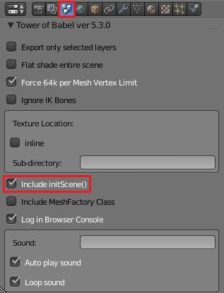

# Scene Transitions #


.blend files which are then generated with `Include initScene()` checked, can use transitions to smooth the addition of an instance of all elements exported.  The arguments of the generated call are:
```typescript
/**
 * Create an instance of all meshes / lights / shadows / and camera exported.
 * @param {BABYLON.Scene} scene - Needed for the constructor of all elements.
 * @param {string} resourcesRootDir - The directory location to start to look for texture files. Default "./"
 * @param {BABYLON.Vector3} positionOffset - When specified, assign the position of all elements with this offset.  Meshes can still FreezeWorldMatrix.
 * @param {string} sceneTransitionName - The name of the transition to use, when desired.
 * @param {number} overriddenMillis - The millis the transition should take when the default should not be used.
 * @param {BABYLON.Sound} overriddenSound - The transition sound which should be played, when the default should not be used.
 * @param {{}} options - A dictionary to place extra options which some transitions may require.
 */
export function initScene(scene : BABYLON.Scene,
                          resourcesRootDir : string = "./",
                          positionOffset? : BABYLON.Vector3,
                          sceneTransitionName? : string,
                          overriddenMillis? : number,
                          overriddenSound? : BABYLON.Sound,
                          options? : {}
) : void;
```
## Stock Transitions ##
This table lists all of the transitions contained within the QI distribution.  `Incremental Use` refers to transitions which can be used when they are being added onto a scene already with objects.  Technically, any transition could still be used though certain transition only make sense when they are the initially displayed items.

|Transition|Default Duration|Default Sound|Incremental Use
| --- | --- | --- | ---
|INTO_FOCUS|5000|None|No
|TO_COLOR|5000|None|No
|VISIBLITY|5000|None|Yes

## Custom Transitions ##
Custom Transitions are class which implement the `QI.Transition` interface:
```typescript
module QI {
    export interface Transition {
        initiate(meshes : Array<BABYLON.AbstractMesh>, overriddenMillis : number, overriddenSound : BABYLON.Sound, options? : {}) : void;
    }
}```
Many of the arguments are those passed using `initScene()` arguments.  The `meshes` argument is passed by the generated code.  This is used by transitions which are made by adjusting each of the new meshes.

The transition should be performed using one of the `QI.NonMotionEvent` sub-classes.  These can run using privileged time option.  If the event queues of any of the meshes have events immediately added, they will not start until the transition is complete.
