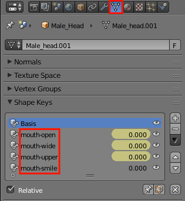

#Tower of Babel Exporter for Blender

## Background: ##

All Add-ons for Blender need to be written in Python.  The original Blender exporter was written as a single static class with some helper functions.  Everything was converted from Blender's representation of things to BJS's at the same time it was written out, in a single pass.  Some of the conversions made were from quads to triangles, and from right-handed coordinates to left-handed.

Tower of Babel started with that code base, re-factoring it into a set classes that represented each of the various scene object types, .e.g. Lights, Materials, Cameras, & Meshes.  The idea was that the main class would make a first pass through the Blender scene, creating instances of all these classes.  The constructors of each of these classes was responsible for all the conversion needed to represent things in BJS, and storing this data as members of that instance.

The main class could then make a 2nd pass, against the collections of these Python classes, and execute a `to_scene_file()` method each class had.  Since all the information had already been pre-processed to be compatible, all these methods had to was the bare minimum to write-out their information in JSON format, A.K.A. a .babylon file. 

Hmm, if there was also a method in each class named `to_script_file(is_typescript)`, then an inline .JS and / or .TS module source file could also be generated from the same information.  Early Tower of Babel versions could generate all 3, and the inspiration for the name Tower of Babel.  

Eventually, the .babylon exporter was replaced with the Tower of Babel code base, with source code generation removed.  Tower of Babel, itself, no-longer generates a .babylon file.  There is an attempt to keep the first pass of both as similar as possible using diff tools.  Either exporter can be used in Blender without the other.  They can also both be present.

##Compare / Contrast to .babylon Exporter##
---
###Differences due to the type of the file generated.###
**Loading / Calling**-  A .babylon file is treated as data, and must be loaded asynchronously.  If you need to execute code that is reliant on a .babylon loading, it must be provided as a callback function to scene loader.  Things can get tricky when there is a whole series of .babylon files. All .JS files are loaded and parsed prior to any JavaScript executing.  This means any objects can be instanced simply using `new`, then placing any reliant code on the next line, e.g. 
```typescript
// materialsRootDir and source optional
var mesh = new ModuleName.MeshClass("name", scene, materialsRootDir, source);
mesh.position.x = 6;
```
**Combining & Uglify**-  .JS module files can be combined together with others (there could be order issues though), while .babylon files cannot.  The generated .JS modules are meant to be readable with lots of whitespace.  When deploying, they can also be uglified.  If your files become very large or your web server has limited bandwidth, the difference in load behavior may be pronounced, though.  A combined & uglified approach probably will result in a faster up and running scene than a .babylon, but appear unresponsive.  This is not a problem for mobile apps coming from a store.

**OO development & source code management**-  A .babylon file must have Javascript which reads it, `BABYLON.SceneLoader`, then takes the data and constructs `BABYLON.Mesh` objects.  There is no dynamic code execution in Javascript, so no sub-classing of `BABYLON.Mesh` is possible.  See Meshes under Features to see Tower of Babel's sub-classing capabilities.  Also, generated source code files, especially .TS files, are much better for placing in repositories like, Git.

###Feature Differences###
Currently, the 2 exporters are pretty close feature wise.  Here are the feature unique to Tower of Babel:

- Morphing using Shapekeys
- Cloning using Mesh Class Factories

##Features & Usage##
---
This document is not going to attempt to describe the actual mesh modeling or material creation.  There are many resources that show that.  We are concerned here with which features of Blender are exporteable, and how to access them.

There are custom properties that are explicitly added by the exporter to control the export.  There are also built-in properties that are mapped into BabylonJS properties.

###Custom Properties###
The exporter adds custom properties to both the Exporter as well as some object types. The properties for objects are displayed as a section on their respective Data properties Tab.  The Exporter properties are displayed in the bottom left corner, when the Export menu item is clicked.  

|Exporter (on Scene tab) | Mesh |
| --- | --- 
||

| Camera | Light
| --- | --- 
||

The settings for each are saved with the .blend file.

###Mapped Properties###
Blender has many scattered properties that are taken into account by the exporter.  Here is an assortment of where these properties are located:

|World (Blender Render)| Blender Game Render Settings | Rotation Units
|+---+|+---+|+---+
|||

###Meshes###
Meshes are output as a public sub-class of the base class custom property when they do not have a mesh as a parent.  They are output as an internal function which returns an instance of the base class custom property.  These child functions are called by the constructor or function of the parent mesh, never by you.  Here is the syntax again (source is for cloning):

```typescript
var mesh = new ModuleName.MeshClass("name", scene, materialsRootDir, source); // materialsRootDir and source optional
```

####Morph.Mesh Classes####
|  | 
|---|---
|  | If a mesh contains Shape Keys, then the mesh is derived from a Morph.Mesh base class.  You create a `Basis` shape key and all of the other keys relative to it.  The name of the shape key is important.  The format is SHAPE_KEY_GROUP-KEY.  This provides for having groups like mouth, left_eye, etc.  On the BJS side, having separate groups allows for concurrent, independent deformations.  No animation on Blender side is transferred.  This feature is experimental.  Armatures and shapekeys are not current compatible. 

####Mesh Class Factories####
This feature allows Meshes to be instanced on demand, using the existing geometry of another instance, if available.  The BJS terminology for this is cloning.  Sharing of geometry reduces GPU & CPU memory, and is very fast to create due to the lack of GPU calls to load data.  This is enabled using a custom property checkbox in the exporter, see below. The class factory needs to be instanced and then called like:

```typescript
var factory = new ModuleName.MeshFactory(scene, materialsRootDir); // materialsRootDir optional
var mesh = factory.instance("meshClassNm1", cloneSkeleton); // cloneSkeleton optional
```
cloneSkeleton is an optional argument.  When `true`, it also clones the skeleton from the source.  It has no meaning unless the mesh class has an armature.

If there are multiple exports with class factories in them, the Tower of Babel runtime can assist with grouping factories together, so you can specify both the modulename and mesh class as strings.  The Dialog extension uses this so Letter meshes can specified as:

```typescript
TOWER_OF_BABEL.MeshFactory.instance("Font2D", "W") //get a W mesh from the Font2D module 
```
 A factory, once instanced, must be pushed onto the array of factories like:
 
```typescript
TOWER_OF_BABEL.MeshFactory.MODULES.push(new Font2D.MeshFactory(scene));
```

###Camera Options###

###Light / Shadow Generating###
Blender has different names for the lights than BabylonJS.  Actually, Blender calls them lamps, not Lights.  Here is how they coorelate:

|Blender | BabylonJS | Shadow Capable
| --- | --- |+---+
|Point | Point | √
|Sun | Directional | √
|Spot | Spot |
|Hemi | Hemi |
|Area | Hemi |

###Blender or Internal Render###
####Materials####
Materials that were made for either the 


####Textures####
Textures can be added onto a material of mesh, so the faces that are assigned for the texture are the materials. Image textures are normally just a file copy, with some properties used as directions for BJS.  If there are any procedural textures anywhere for a mesh, then the image is worked into the baked images instead.

|Procedural Textures| Image Textures
|+---+|+---+
||

###Cycles Render / Texture Baking###
###Armatures###
###Fcurve Animations###
Fcurve animations for Meshes, lights, and Cameras are transferred on export.  See the table below to see which properties are animatable, based on the object type.  If 
##Structure of Generated Module##
---
The typescript module version is the one described below.  There are 2 features that are omitted from the sample code though:

- Every entry point validates that the version of Babylon is compatible, as shown below.  This is omitted from all other sample code.  
- Optional console browser logging done when entry points are called.

```typescript
if (Number(BABYLON.Engine.Version.substr(0, BABYLON.Engine.Version.lastIndexOf("."))) < 2.1) throw "Babylon version too old";
```

As with all .TS files, it starts off defining the module that the classes are a part of.  The module name matches the file name you made for the export.
```typescript
// File generated with Tower of Babel version: 3.0.0 on 07/14/15
module ModuleName{
    ...
```

###initScene()###
If you indicated that you wanted an `initScene()` included, it will be generated next.  When you call this function in your application code, it will do the .babylon file equivalent of `BABYLON.SceneLoader.Append()`.  You pass a previously instanced scene as an argument, and may also pass `resourcesRootDir`.  `resourcesRootDir` is very tolerant about whether you terminate it with a `/` or not.  The default is the same as the html file. When `initScene()` is called, the root directory of texture files & sound files must be the same.

The example below shows when everything is present.  The calling of the definition of skeletons, cameras, , sounds, lights, and shadows are only added when there are some to define.

```typescript
export function initScene(scene : BABYLON.Scene, resourcesRootDir : string = "./") : void {
    scene.autoClear = true;
    scene.clearColor    = new BABYLON.Color3(0,0,0);
    scene.ambientColor  = new BABYLON.Color3(0,0,0);
    scene.gravity = new BABYLON.Vector3(0,-9.81,0);

    // define materials & skeletons before meshes
    defineMaterials(scene, resourcesRootDir);
    defineSkeletons(scene);

    // instance all root meshes
    if (typeof (TOWER_OF_BABEL) !== 'undefined'){
        TOWER_OF_BABEL.MeshFactory.MODULES.push(new MeshFactory(scene));
        TOWER_OF_BABEL.MeshFactory.instance("ModuleName", "meshClassNm1", true);
        TOWER_OF_BABEL.MeshFactory.instance("ModuleName", "meshClassNm2", true);
    } else {
        new meshClassNm1("meshClassNm1", scene);
        new meshClassNm2("meshClassNm2", scene).makeInstances();
    }

    // define cameras after meshes, incase LockedTarget is in use
    defineCameras(scene);

    // define sounds after meshes, incase attached
    defineSounds(scene, resourcesRootDir);

    // cannot call Shadow Gen prior to all lights & meshes being instanced
    defineLights(scene);
    defineShadowGen(scene);
}
```
The example above shows when a MeshFactory class is also included.  A check is made for the Tower of Babel runtime.  If it's found then the MeshFactory is installed into it, and mesh instances are made that way.  When is MeshFactory not included, this code is not included.

###MeshFactory Class###
This is an example of a mesh factory, showing only one class that is instanceable, `meshClassNm1`.  The below switch statement will be expanded with a case statement for each root level mesh in the module that does not contain shapekeys.  See section in Features & Usage, above, for calling instructions.

```typescript
var meshLib = new Array<Array<BABYLON.Mesh>>( **NUMBER_OF_ROOT_MESHES** );
var cloneCount = 1;

var originalVerts = 0;
var clonedVerts = 0;
export class MeshFactory implements TOWER_OF_BABEL.FactoryModule {
    constructor(private _scene : BABYLON.Scene, materialsRootDir: string = "./") {
        get_baked.defineMaterials(_scene, materialsRootDir); //embedded version check
    }

    public getModuleName() : string { return "ModuleName";}
    public instance(meshName : string, cloneSkeleton? : boolean) : BABYLON.Mesh {
        var ret:BABYLON.Mesh = null;
        var src:BABYLON.Mesh;
        switch (meshName){
            case "meshClassNm1":
                src = getViable(0);
                if (src === null){
                    ret = new meshClassNm1("meshClassNm1", this._scene);
                    originalVerts += ret.getTotalVertices();
                    meshLib[0].push(ret);
                }else{
                    ret = new meshClassNm1("meshClassNm1" + "_" + cloneCount++, this._scene, null, <meshClassNm1> src);
                    clonedVerts += ret.getTotalVertices();
                }
                break;
            ...
        }
        if (ret !== null){
            if (cloneSkeleton && src && src.skeleton){
                var skelName = src.skeleton.name + cloneCount;
                ret.skeleton = src.skeleton.clone(skelName, skelName);
            }
        }
        else BABYLON.Tools.Error("Mesh not found: " + meshName);
        return ret;
    }
}
function getViable(libIdx : number, isNode? : boolean) : BABYLON.Mesh {...}
function clean(libIdx : number) : void {...}
export function getStats() : [number] { return [cloneCount, originalVerts, clonedVerts]; }
```

###defineMaterials()###
The defineMaterials() is an module level function of the module.  It is called from many of the other entry points, so you are not usually required to call it.  It also has checking at the beginning to ensure it only does something on the first call.

Shown below are a standard material, and another with a baked inline texture.  The pattern will repeat for as many materials exported.
```typescript
var matLoaded = false;
export function defineMaterials(scene : BABYLON.Scene, materialsRootDir : string = "./") : void {
    if (matLoaded) return;
    if (materialsRootDir.lastIndexOf("/") + 1  !== materialsRootDir.length) { materialsRootDir  += "/"; }
    var material : BABYLON.StandardMaterial;
    var texture : BABYLON.Texture;
    
    material = new BABYLON.StandardMaterial("get_baked.Dirt", scene);
    material.ambientColor  = new BABYLON.Color3(0.302,0.4121,0.8);
    material.diffuseColor  = new BABYLON.Color3(0.2416,0.3297,0.64);
    material.specularColor = new BABYLON.Color3(0.5,0.5,0.5);
    material.emissiveColor = new BABYLON.Color3(0,0,0);
    material.specularPower = 50;
    material.alpha =  1;
    material.backFaceCulling = true;
    material.checkReadyOnlyOnce = true;
    
    material = new BABYLON.StandardMaterial("get_baked.WoodMat_Ground", scene);
    material.backFaceCulling = true;
    material.checkReadyOnlyOnce = true;
    texture = BABYLON.Texture.CreateFromBase64String("data:image/PNG;base64,...", "name", scene);
    texture.hasAlpha = false;
    texture.level = 1;
    texture.coordinatesIndex = 0;
    texture.coordinatesMode = 0;
    texture.uOffset = 0;
    texture.vOffset = 0;
    texture.uScale = 1;
    texture.vScale = 1;
    texture.uAng = 0;
    texture.vAng = 0;
    texture.wAng = 0;
    texture.wrapU = 0;
    texture.wrapV = 0;
    material.diffuseTexture = texture;        
    ...
    var multiMaterial : BABYLON.MultiMaterial;
    multiMaterial = new BABYLON.MultiMaterial("get_baked.Multimaterial#0", scene);
    multiMaterial.subMaterials.push(scene.getMaterialByID("get_baked.Dirt"));
    multiMaterial.subMaterials.push(scene.getMaterialByID("get_baked.WoodMat_Ground"));
    matLoaded = true;
}
```

###Meshes###
####Root Mesh Sub-Classes####
Here is an example of a mesh which has no parent mesh.  It is implemented as a subclass of the base class.
```typescript
export class MeshClass extends BABYLON.Mesh {
    // all child meshes are declared as public members and instanced in constructor
    public Appendage : BABYLON.Mesh;
    ...

    constructor(name: string, scene: BABYLON.Scene, materialsRootDir: string = "./", source? : MeshClass) {
        super(name, scene, null, source, true);

        ModuleName.defineMaterials(scene, materialsRootDir); //embedded version check
        var cloning = source && source !== null;
        
        // position, rotation, scaling section
        this.position.x  = 0;
        this.position.y  = 4;
        this.position.z  = 0;
        this.rotation.x  = 0;
        this.rotation.y  = 0;
        this.rotation.z  = 0;
        this.scaling.x   = 1;
        this.scaling.y   = 1;
        this.scaling.z   = 1;
        this.freezeWorldMatrix(); // generated based on custom property
        
        // child mesh instancing
        this.appendage = cloning ? child_Appendage(scene, this, source.Appendage) : child_Appendage(scene, this);
        ...

        // miscellaneous properties section
        this.id = this.name;
        this.billboardMode  = 0;
        this.isVisible       = true;
        this.setEnabled(true);
        this.checkCollisions = false;
        this.receiveShadows  = false;
        this["castShadows"]  = true; // typescript safe
                
        // when has a physics imposter
        if (!scene.isPhysicsEnabled()) {
            scene.enablePhysics();
        }
        this.setPhysicsState({ impostor: 1, mass: 25.2, friction: 1.2, restitution: 9.2});
        
        // geometry loading section
        if (!cloning){
            // added when armature present
            defineSkeletons(scene);
            this.skeleton = scene.getLastSkeletonByID("0");
            
            // not all may be present
            this.setVerticesData(BABYLON.VertexBuffer.PositionKind, [...], false); // true when Morphing
            this.setVerticesData(BABYLON.VertexBuffer.NormalKind, [...], false); // true when Morphing
            this.setVerticesData(BABYLON.VertexBuffer.UVKind, [...], false);
            this.setVerticesData(BABYLON.VertexBuffer.UV2Kind, [...], false);
            this.setVerticesData(BABYLON.VertexBuffer.ColorKind, [...], false);
            this.setVerticesData(BABYLON.VertexBuffer.MatricesWeightsKind, [...], false);
            this.setVerticesData(BABYLON.VertexBuffer.MatricesIndicesKind, [...], false);
            this.setIndices([...]); // required

            this.setMaterialByID("ModuleName.materialName");
            this.subMeshes = [];
            new BABYLON.SubMesh(0, 0, 2834, 0, 9792, this);
        }
    }

    // when using a mesh factory class, this override is also added
    public dispose(doNotRecurse?: boolean): void {
        super.dispose(doNotRecurse);
        clean(3);  // the index into meshLib
    }
}
```

####Child Mesh Instances####
Here is the child mesh called by the root mesh above.  All of the same sections of the root mesh are present, except with 'ret' assigned, not 'this'.
```typescript
function child_Appendage(scene : BABYLON.Scene, parent : any, source? : any) : BABYLON.Mesh {
    var ret = new BABYLON.Mesh(parent.name + ".Appendage", scene, parent, source);
    var cloning = source && source !== null;
    
    // same position rotation, scaling section,     
    ret.position.x  = 0;
    ...

    return ret;
}

####Morph based Meshes####

###defineCameras() [Optional]###
if calling defineCameras yourself, be sure to wait until any mesh that might be a locked target for it has been instanced.  This only applies to ArcRotateCamera, and FollowCamera.

```typescript
export function defineCameras(scene : BABYLON.Scene) : void {
    var camera;
        
    camera = new BABYLON.ArcRotateCamera("Camera", -1.2873, -1.4918, 8.0977, scene.getMeshByID("MeshNm"), scene);
    camera.setCameraRigMode(0,{interaxialDistance: 0.06369999796152115});
    camera.rotation = new BABYLON.Vector3(0.4615,-0.8149,0.0981);
    camera.fov = 0.8576;
    camera.minZ = 0.1;
    camera.maxZ = 100;
    camera.speed = 1;
    camera.inertia = 0.9;
    camera.checkCollisions = false;
    camera.applyGravity = false;
    camera.ellipsoid = new BABYLON.Vector3(0.2,0.9,0.2);
    scene.setActiveCameraByID("Camera");
    // any camera animations here
    ...
    }
```

###defineSounds() [Optional]###
Sound files can be assigned at both the scene and the mesh levels.  The sound is never really in Blender.  It is all custom property settings.  The scene is paused from rendering until the sounds are ready to play.

```typescript
var soundsLoaded = false;
export function defineSounds(scene : BABYLON.Scene, soundsRootDir : string = "./") : void {
    if (soundsLoaded) return;
    if (soundsRootDir.lastIndexOf("/") + 1  !== soundsRootDir.length) { soundsRootDir  += "/"; }
    var sound : BABYLON.Sound;
    var connectedMesh : BABYLON.Mesh;

    // version when sound assigned at the scene level
    sound = new BABYLON.Sound("scene.wav", soundsRootDir + "SceneSound.wav", scene, 
                              () => { scene._removePendingData(sound); }, 
                              {autoplay: true, loop: false});
    scene._addPendingData(sound);
    
    // version when sound assign at the mesh level    
    sound = new BABYLON.Sound("mesh.wav", soundsRootDir + "mesh.wav", scene, 
                              () => { scene._removePendingData(sound); }, 
                              {autoplay: true, loop: false, maxDistance: 34.4});
    scene._addPendingData(sound);
    connectedMesh = scene.getMeshByID("MeshNm");
    if (connectedMesh) {
        newSound.attachToMesh(connectedMesh);
    }
    soundsLoaded = true;
}
```

###defineLights() / defineShadowGen() [Optional]###
If there were any lights exported, the function `defineLights()` will be in the file.  All lights will be instanced on after another (only one being shown).  When a light has animations, they will be defined right after each light.

If any lights were set to be shadow generators, `defineShadowGen()` will also be in the file.  It is called at the end of `defineLights()` and not exported, so you cannot call it yourself.  The sample below only shows one generator, but if there were more, they would done one right after another.  The reason this function is even broken out is because a .babylon file defines shadow generators separate from lights.  This causes 

```typescript
export function defineLights(scene : BABYLON.Scene) : void {
    var light;
    
    light = new BABYLON.DirectionalLight("Directional_Lamp", new BABYLON.Vector3(0.0009,-0.3458,0.9383), scene);
    light.position = new BABYLON.Vector3(-0.0294,11.2822,-30.6172);
    light.intensity = 0.6;
    light.diffuse = new BABYLON.Color3(1,1,0.9);
    light.specular = new BABYLON.Color3(0,0,0);
    // any light animations here
    ...
    // added when there are any shadow generators
    defineShadowGen(scene);
    }
    
function defineShadowGen(scene : BABYLON.Scene) : void {
    var light;
    var shadowGenerator : BABYLON.ShadowGenerator;

    light = scene.getLightByID("Directional_Lamp");
    shadowGenerator = new BABYLON.ShadowGenerator(4098, light);
    shadowGenerator.bias = 0;
    shadowGenerator.useVarianceShadowMap = true;
    ...
    freshenShadowRenderLists(scene);
}
```

###freshenShadowRenderLists()###

`freshenShadowRenderLists()` is for updating the renderlist's of all shadow generators, after being initially called at the end of `defineShadowGen()`.  Useful to call when generating meshes on demand, e.g. using a mesh factory. 

`freshenShadowRenderLists()` is a generalized function, to support definition of lights and shadows in separate .blends from meshes.  It is always included for convience.  If you have multiple generated files, calling anyone once, is all that is required.
 
```typescript
export function freshenShadowRenderLists(scene : BABYLON.Scene) : void {
    var renderList = [];
    for (var i = 0; i < scene.meshes.length; i++){
        if (scene.meshes[i]["castShadows"])
            renderList.push(scene.meshes[i]);
    }

    for (var i = 0; i < scene.lights.length; i++){
        if (scene.lights[i]._shadowGenerator)
            scene.lights[i]._shadowGenerator.getShadowMap().renderList = renderList;
    }
}
```

## Running ##
---
The exported .JS file must of course be referenced in the `<head>` section of the launch html.  Depending on what features you take advantage of, other .JS files need inclusion as indicated.  If you combine / uglify, then use the order shown below:
```html
<head>
    <meta charset="UTF-8">
    <script src="http://cdn.babylonjs.com/2-1/babylon.js"></script>
    // TOB-runtime is optional even when using MeshFactory Classes
    <script src="./TOB-runtime.js"></script>

    // Shapekeys need Morph extension, which is requires POV
    <script src="./POV.1.1.js"></script>
    <script src="./morph.1.2.js"></script>

    // any files holding a base class of a mesh goes prior to the generated file
    <script scr="./baseclass.js"></script>
    
    // the TOB generated file itself
    <script src="./myExportedModule.js"></script>
    
    // any files which might be subclassing any generated mesh classes
    <script src="./subclass.js"></script> 
    ...
</head>

```